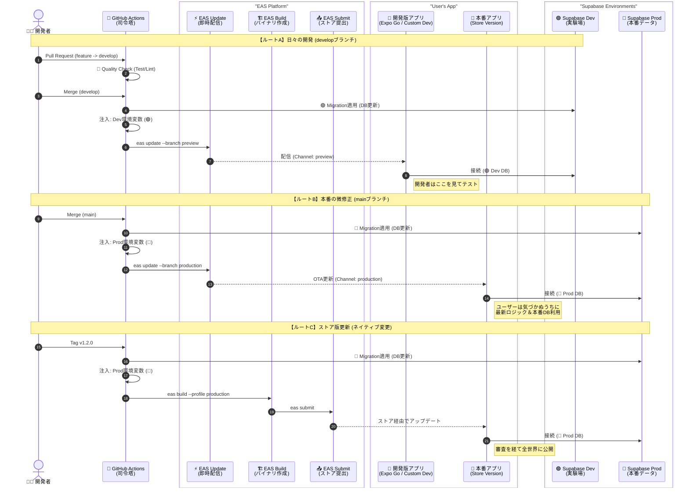

# Expo Supabase Google Auth Project

このプロジェクトは、Expo、Supabase、Google Authを使用したモバイルアプリのテンプレートです。
本番環境（Production）と開発環境（Development）を厳密に分離し、GitHub Actionsを用いたCI/CDパイプラインによって安全な開発フローを実現しています。
さらに、**データベースのマイグレーション（構造変更）もCI/CDで自動化**されており、コードとDBの整合性が常に保たれます。

## 機能

*   **Expo Router**: ファイルベースのルーティング
*   **Supabase Auth**: Google Sign-In (Native) を使用した認証
*   **Environment Separation**: Development / Production の環境分離
*   **CI/CD**: GitHub Actions + EAS Update による自動デプロイ
*   **Quality Check**: PR作成時の自動テスト (Type/Lint/Test)
*   **Automated Migration**: Supabase CLIによるDB構造の自動更新

## アーキテクチャ

データ事故を防ぐため、2つのSupabaseプロジェクトと2つのGitブランチを使用します。
GitHub Actionsがブランチに応じて環境変数を注入し、接続先DBを自動で切り替えます。



## 環境変数 (Environment Variables)

**絶対にリポジトリにコミットせず**、以下の場所に設定してください。

### 1. ローカル開発用 (`.env`)
プロジェクトルート (`my-app/.env`) に作成します（.gitignore済み）。

| 変数名 | 取得方法 (入手先) | 設定値の例 |
| :--- | :--- | :--- |
| `EXPO_PUBLIC_SUPABASE_URL` | **Supabase (Dev)** > Project Settings > API | `https://xxx.supabase.co` |
| `EXPO_PUBLIC_SUPABASE_ANON_KEY` | **Supabase (Dev)** > Project Settings > API | `eyJhbGciOiJIUzI1...` |
| `EXPO_PUBLIC_GOOGLE_WEB_CLIENT_ID` | **Google Cloud** > Credentials > OAuth 2.0 Client ID (Web) | `123...apps.googleusercontent.com` |

### 2. GitHub Actions用 (CI/CD Secrets)
GitHubリポジトリの **Settings > Secrets and variables > Actions > New repository secret** に登録します。

| 変数名 (Secret Name) | 取得方法 (入手先) | 役割 |
| :--- | :--- | :--- |
| `EXPO_TOKEN` | **Expo** > User Settings > Access Tokens | EASへのデプロイ権限 |
| **Production (本番用)** | | |
| `PROD_SUPABASE_URL` | **Supabase (Prod)** > Project Settings > API | 本番アプリの接続先URL |
| `PROD_SUPABASE_KEY` | **Supabase (Prod)** > Project Settings > API | 本番アプリのAPIキー (Anon) |
| `PROD_DB_URL` | **Supabase (Prod)** > Settings > Database > Connection String | 本番DBマイグレーション用URI (postgres://...) |
| **Development (開発用)** | | |
| `DEV_SUPABASE_URL` | **Supabase (Dev)** > Project Settings > API | 開発アプリの接続先URL |
| `DEV_SUPABASE_KEY` | **Supabase (Dev)** > Project Settings > API | 開発アプリのAPIキー (Anon) |
| `DEV_DB_URL` | **Supabase (Dev)** > Settings > Database > Connection String | 開発DBマイグレーション用URI (postgres://...) |

## セットアップ手順

### 1. 依存関係のインストール

```bash
bun install
```

### 2. データベースの変更管理

このプロジェクトはSupabase CLIで管理されています。

```bash
# 変更を作成
bunx supabase migration new create_users_table

# SQLファイルを編集後、ローカルまたはDev環境に適用
bunx supabase db push
```

### 3. アプリの起動

```bash
bunx expo start
```

### 4. テスト実行

品質チェックをローカルで実行します。

```bash
# 単体テスト
bun run test

# 型チェック
bun run tsc --noEmit

# Lintチェック
bun run lint
```

## ディレクトリ構造

*   `app/`: 画面・ルーティング
*   `components/`: UIコンポーネント
*   `lib/`: 外部サービス設定
*   `supabase/migrations/`: DBマイグレーションファイル (SQL)
*   `__tests__/`: Jestテストファイル
